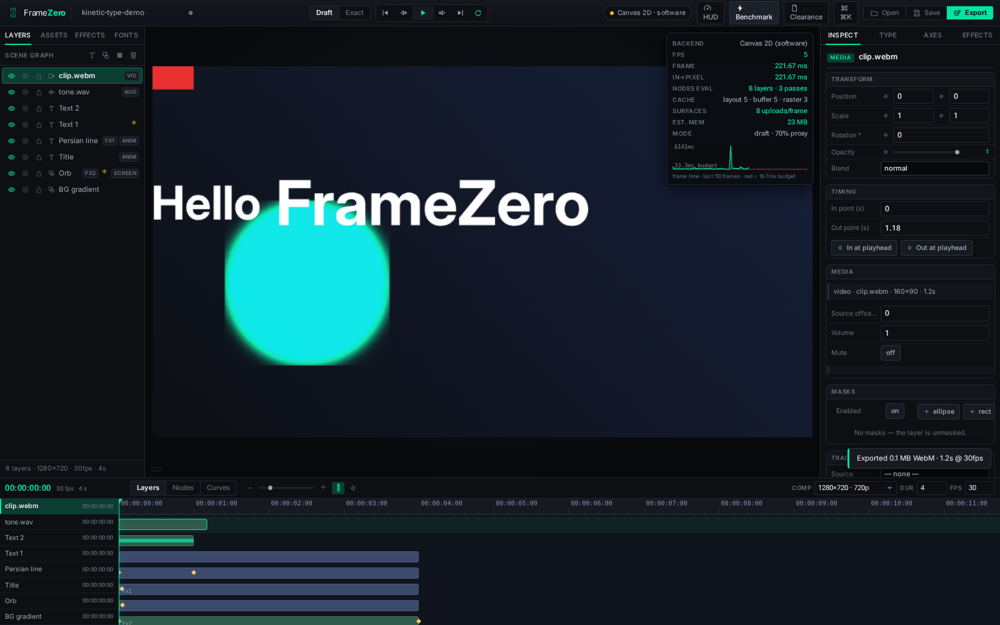

<p align="center">
  
</p>
<h1 align="center">FrameZero</h1>
<p align="center">
  <b>A browser-native motion-design &amp; kinetic-type studio.</b><br>
  Composition, variable-font typography, effects, masks, track mattes, media and
  audio — in one GPU-minded timeline app that runs from a static server.
</p>
<p align="center">
  
  
  
</p>



---

## What it is

FrameZero is a real editor, not a demo: a scene-graph document model with
undo/redo and corruption-repairing deserialization, a deterministic rasterize
pipeline that runs identically on two backends (WebGL2 and Canvas 2D), a
professional variable-font typography engine, and honest performance
instrumentation (frame-time HUD, node/pass counters, benchmark harness).

| Area | What you get |
|---|---|
| **Composition** | Layer stack (text / shape / solid / media), transforms with keyframes & easing curves, blend modes, solo/lock/visibility, in/out points, auto-key |
| **Typography** | Variable fonts with real axis control (incl. all 13 Roboto Flex axes), per-character animators, Persian/Arabic shaping-safe stack, **Font Clearance Report** that audits glyph coverage per font |
| **Effects** | 16 effects (blur, glow, shadow, color ops, displacement, …) as a per-layer chain, keyable parameters, identical output on both backends |
| **Masks & mattes** | Pen/ellipse/rect masks with add/subtract/intersect, feather, invert, per-item and stack toggles; alpha & luma track mattes that follow the source transform |
| **AE layer semantics** | Adjustment layers (chain grades the composite below), time remap with reverse rate, boundary transitions (cross dissolve, wipes, slides), comp markers with colours & labels |
| **Monitoring** | Lumetri-style scopes (luma waveform, histogram, vectorscope) from the live readback, title/action safe areas, thirds grid |
| **Media & audio** | Image / video / audio import with decode-at-import, waveform envelopes in the timeline, video sync with drift correction, per-layer volume/mute, master gain |
| **Export** | Real WebM video via MediaRecorder on the canvas stream + master audio; PNG frame export; project save/open (JSON) |
| **Performance** | WebGL2 batched pipeline with raster cache & proxy scaling, draft/exact modes, frame-time HUD with budget line, benchmark harness, software-fallback honesty |
| **Chrome** | Full SVG icon set, generated brand mark, keyboard-first workflow, command palette, hi-DPI crisp UI |

## Quick start

```bash
npm install        # only dev dependency: playwright (tests + brand tooling)
npm start          # → http://localhost:4173
```

The app itself has **zero runtime dependencies** — plain ES modules, no build
step. Open `http://localhost:4173`, press `T` for a text layer, `Space` to play.

## The test gate

Every change must keep the whole gate green; nothing ships on vibes.

| Gate | Command | Current |
|---|---|---|
| Module syntax (14 modules) | `npm run test:syntax` | 14/14 |
| CSS audit (JS classes without styles) | `npm run test:css` | 0 missing / 74 |
| Typography engine | `npm test -- typography` | 107 / 0 fail |
| Render core (2 backends, 16 effects, masks/mattes, media) | `npm test -- render` | 94 / 0 fail |
| Document model, resolver, undo, corrupt-file repair | `npm test -- document` | 106 / 0 fail |
| **The real product in a real browser** (boot → video export) | `npm run test:smoke` | 97 / 0 fail |
| | **total** | **404 checks** |

Pixel-level tests compare backends against each other and against synthesized
ground truth (byte-exact WAV, in-browser-recorded WebM). The smoke suite also
asserts identity hygiene: favicon/brand art load, every transport button carries
an SVG icon, and a regexp scan proves **no emoji anywhere in the chrome**.

## Performance, honestly

There is no marketing number here. The HUD reports measured frame time,
in→pixel latency, nodes evaluated, cache state, surfaces uploaded and estimated
memory, with a 33.3 ms budget line. On machines without a GPU the app says so
(`Canvas 2D (software)`) and stays usable via proxy scaling and draft mode —
see `STATUS.md` for measured tables and the benchmark methodology (WebGL2 loops
are timed with a readback sync-point, never with command-queue time).

## Typography

Four bundled variable fonts (OFL): Inter, Roboto Flex (all 13 axes), Noto Sans
Arabic and Vazirmatn for full Persian glyph coverage. Axes are applied through
CSS-Fonts-5 `variationSettings` on `FontFace`, client-side — the Font Clearance
Report shows exactly which glyphs each family covers for your text.

## Repository layout

```
public/            the product (index.html, js/, css/, fonts/, brand/)
  js/core/         document model, resolver, compositor (2 backends)
  js/ui/           panels, icons, timeline, palette
  brand/           generated mark: logo.png / logo-180.png / favicon.png
tools/             test suites, css audit, brand generator, hi-DPI UI shots
tests/             pixel & model fixtures
docs/              screenshots used by this README
STATUS.md          the honest completeness ledger (bugs found, lessons, roadmap)
```

## Brand

The mark was generated as four AI candidates; the chosen one encodes the
product name three ways — corner brackets (frame/viewport), the vertical bar
(playhead) and the centre ring (Zero, echoing the keyframe diamond). It is
keyed to transparency and recoloured to the exact UI accent `#00E5A0`
(`tools/brand.mjs`), with a hand-drawn optical variant for the 16–32 px
favicon. All four candidates remain in `public/logos/`.

## Roadmap

Precomps with essential properties, expressions (sandboxed subset), offline
render queue with H.264/mp4, WebGPU backend, ripple/roll/slip trim tools,
waveform editing (trim/crossfade), audio effects, image sequences, preset
library, motion tracking, multi-user collaboration. The full parity matrix
against After Effects & Premiere Pro lives in `docs/FEATURE-GAP.md`;
progress notes in `STATUS.md`.

## License

MIT — see [LICENSE](LICENSE). Bundled fonts are OFL (see [NOTICE](NOTICE.md)).

---
