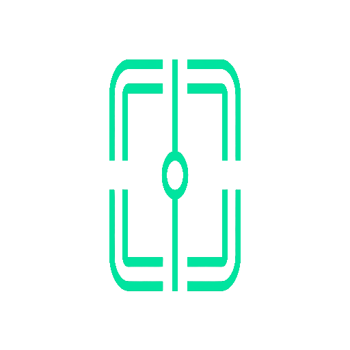
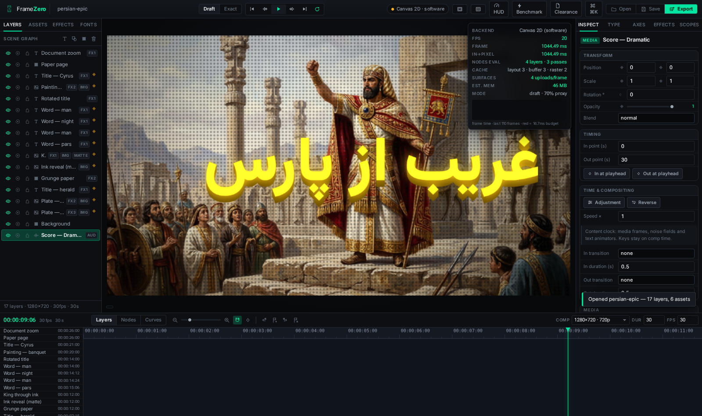

<p align="center">
  
</p>
<h1 align="center">FrameZero</h1>
<p align="center">
  <b>A browser-native motion-design &amp; kinetic-type studio.</b><br>
  Composition, variable-font typography, effects chains, masks, track mattes,
  adjustment layers, time remap, markers and Lumetri-style scopes — one
  GPU-minded timeline app, served statically, with zero runtime dependencies.
</p>
<p align="center">
  
  
  
  
</p>



---

## What it is

FrameZero is a real editor, not a demo: a scene-graph document model with
undo/redo and corruption-repairing deserialization, a deterministic raster
pipeline held to pixel parity on **two backends** (WebGL2 primary, Canvas2D
fallback), a professional variable-font typography engine with RTL shaping,
and honest performance instrumentation (frame-time HUD, node/pass counters,
benchmark harness).

| Area | What you get |
|---|---|
| **Composition** | Layer stack (text / shape / solid / media), keyframed transforms with an easing catalogue, blend modes, solo/lock/visibility, in/out points, auto-key, node-graph & value-curve lenses |
| **AE layer semantics** | Adjustment layers, time remap (rate + reverse), boundary transitions (cross dissolve, wipes, slides), comp markers with colours & labels, alpha & luma track mattes |
| **Typography** | 5 bundled OFL variable fonts (Inter, Roboto Flex with all 13 axes, Noto Sans Arabic, Vazirmatn, Source Serif 4), per-glyph animators, Persian/Arabic shaping-safe layout, **Font Clearance Report** auditing glyph coverage per family |
| **Effects** | 17 effects (blur, bloom, shadow, colour ops, halftone, glitch, …) as per-layer chains with keyable parameters — identical pixels on both backends |
| **Masks** | Pen/ellipse/rect masks with add/subtract/intersect, feather, invert, per-item and stack toggles |
| **Monitoring** | Lumetri-style scopes (luma waveform, histogram, vectorscope) from the live readback, title/action safe areas, thirds grid |
| **Media & audio** | Image / video / audio import with decode-at-import, waveform envelopes in the timeline, video sync with drift correction, per-layer volume/mute, master gain |
| **Export** | Real WebM (VP9 + Opus) via MediaRecorder on the viewport stream plus master audio, PNG frame export, project save/open (JSON) |
| **Performance** | Batched WebGL2 pipeline with raster & effect-chain caches, proxy scaling, draft/exact modes, frame-time HUD with budget line, reproducible benchmark harness |
| **Chrome** | ~110 hand-drawn SVG icons on one 24×24 grid, keyboard-first workflow, command palette, hi-DPI crisp UI |

## Quick start

```bash
npm ci          # dev-only dependency: playwright (tests, brand & shot tooling)
npm start       # → http://localhost:4173
```

The product itself has **zero runtime dependencies** — plain ES modules, no
build step. Open the URL, press `T` for a text layer, `Space` to play,
`⌘K` for the command palette. Platform-specific setup (macOS, Linux, Windows
WSL2), including the system libraries headless tests need, is documented in
[`docs/PLATFORMS.md`](docs/PLATFORMS.md).

Want to see the engine work before learning it? `Effects → open demo` loads
the shipped 30-second kinetic-type piece (17 layers, scored, exported as WebM
through the product's own exporter).

## The test gate

Every change must keep the whole gate green — `npm run gate` runs all of it:

| Gate | Command | Current |
|---|---|---|
| Module syntax + release hygiene | `npm run test:syntax` | 14 modules · hygiene OK |
| CSS audit (JS classes without styles) | `npm run test:css` | 0 missing / 78 |
| Typography engine (shaping, animators, axes) | `npm test -- typography` | 108 / 0 fail |
| Render core (2 backends, 17 effects, masks/mattes, media, parity) | `npm test -- render` | 134 / 0 fail |
| Document model, resolver, undo, corrupt-file repair | `npm test -- document` | 119 / 0 fail |
| **The real product in a real browser** (boot → export) | `npm run test:smoke` | 117 / 0 fail |
| | **total** | **478 checks** |

Pixel-level tests compare the backends against each other and against
synthesized ground truth. The smoke suite asserts identity hygiene too: brand
art loads, every control carries an SVG icon, and a regexp scan proves **no
emoji or glyph stand-ins anywhere in the chrome**. A separate hygiene gate
keeps prose English and debug scaffolding out of the repository.

## Performance, honestly

No marketing numbers. The HUD reports measured frame time, in→pixel latency,
nodes evaluated, cache state, surfaces uploaded and estimated memory against a
frame-budget line. On machines without a GPU the app says so
(`Canvas 2D · software`) and stays usable through proxy scaling and draft
mode. Measured tables and the benchmark methodology (GL loops timed with a
readback sync-point, never command-queue time) live in
[`STATUS.md`](STATUS.md).

## Parity with the Adobe suite

[`docs/FEATURE-GAP.md`](docs/FEATURE-GAP.md) is the researched matrix against
After Effects and Premiere Pro — what ships, what is partial, what is roadmap,
with sources. v1.1 closed the biggest compositing gaps (adjustment layers,
time remap, transitions, markers, scopes).

## Repository layout

```
public/            the product (index.html, js/, css/, fonts/, brand/, projects/)
  js/core/         document model, resolver, easing/keyframe tracks
  js/render/       compositor + WebGL2 & Canvas2D backends, effects, typography
  js/ui/           panels, icon set, timeline wiring
  projects/        the shipped demo piece (persian-epic.fz.json)
tools/             test suites, audits, exporters, brand & shot generators
public/tests/      headless suites (render, document, typography, diag)
docs/              research notes, platform guide, screenshots
STATUS.md          engineering ledger: what shipped, what it cost, roadmap
```

## Contributing

Start with [`CONTRIBUTING.md`](CONTRIBUTING.md) (workflow + house rules),
[`CODE_OF_CONDUCT.md`](CODE_OF_CONDUCT.md) and
[`SECURITY.md`](SECURITY.md). Third-party attributions (fonts, music,
paintings) are in [`NOTICE.md`](NOTICE.md).

## License

MIT — see [LICENSE](LICENSE). Bundled fonts are SIL OFL; demo assets are
public-domain / CC-BY as itemised in [NOTICE.md](NOTICE.md).
